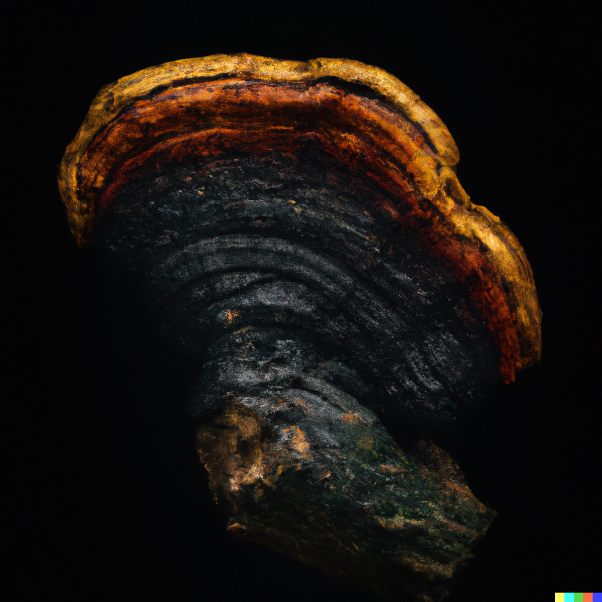

Welcome to Devs Dig Nature! This blog is a unique space where diverse interests come together to form a compelling and informative platform. As the name suggests, this blog primarily caters to web developers and nature enthusiasts, but we also delve into fitness, cryptocurrencies, and the fascinating world of plants and fungi. My mission is to create a space where readers can learn, share, and explore these diverse topics.

## My Story

The idea for Devs Dig Nature was born out of a passion for web development and a deep appreciation for the natural world. The founder, a seasoned web developer, is also an avid gym-goer, cryptocurrency enthusiast, and a lover of plants and fungi. They wanted to create a blog that reflects their multifaceted interests and offers valuable content to a wide range of readers.

## What to Expect

Here at Devs Dig Nature, we strive to provide engaging and informative content that caters to My diverse audience. My blog covers the following topics:

- **Web Development**: Stay up-to-date with the latest trends, tools, and techniques in web development. We share tutorials, tips, and resources to help you sharpen your coding skills and build amazing web projects.

- **Fitness**: Discover workout routines, exercise tips, and advice on maintaining a healthy lifestyle. We believe that fitness plays an essential role in achieving a balanced life, and we aim to motivate and inspire our readers to stay active.

- **Cryptocurrency**: Explore the ever-evolving world of digital currencies, blockchain technology, and decentralized finance. We cover the latest news, trends, and investment opportunities in the cryptocurrency space.

- **Plants and Fungi**: Unearth the fascinating world of plants and fungi, their unique properties, and their impact on our lives. We delve into topics such as cultivation, identification, medicinal uses, and the ecological importance of these incredible organisms.

We hope that our blog will not only inform and entertain but also inspire our readers to explore new interests and ideas.

## Join the Community

We invite you to join the Devs Dig Nature community by following our blog, leaving comments, and sharing our content on social media. We believe that by fostering an inclusive and supportive environment, we can create a space for learning and growth.

Thank you for visiting Devs Dig Nature, and we look forward to sharing this exciting journey with you!
